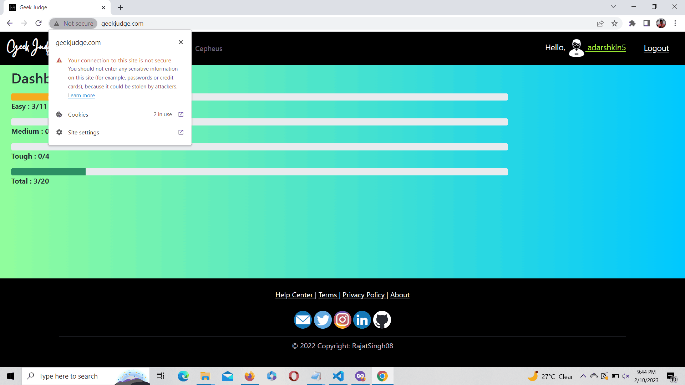

# Image Compression with K-means Clustering

This repository demonstrates how to use the K-means clustering algorithm for image compression. The K-means algorithm is applied to group similar pixels together and represent them using a reduced set of representative values. The compressed image has a smaller file size while maintaining visual quality.

## Dependencies

To run the code in this repository, you need the following dependencies:
- Python 3
- OpenCV
- NumPy

### Original Image
{: width:"400" }

### Compressed Image

## Evaluation
 - initial size of the original image is 625 kb
 - final size after compression is 196 kb

## Possible Future Updates
 - PDF compression
 - Image segmentation
 - Using images segmentation and ocr to read data from PDF

## Image Segmentation

- Original Image
- 
  
## Segmentation with RGB format
- k=4
- 
- k=6
- 

## Segmentation with HSV format
- k=2
- 
- k=4
- 
- k=6
- 
